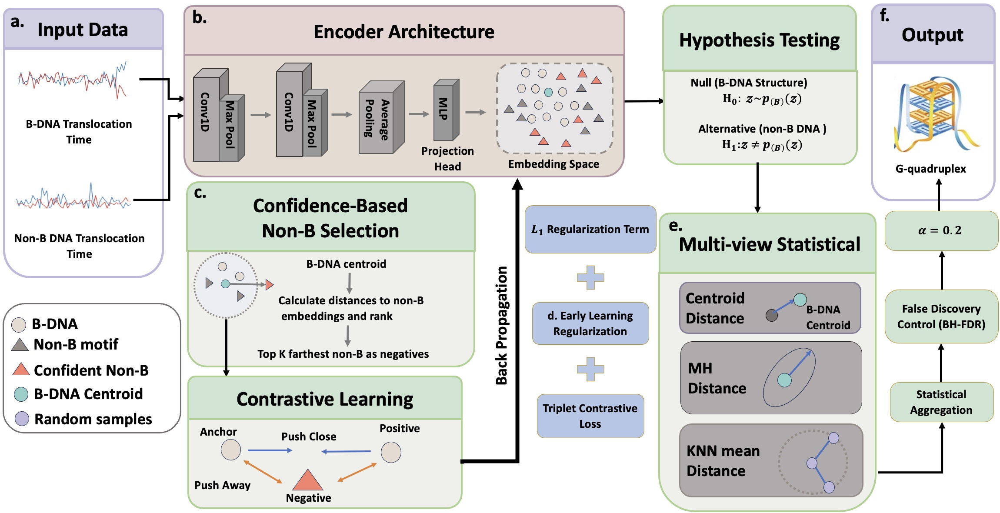

# NR-Contrastive
*Contrastive Learning to Enrich Rare non-B DNA Signals for Structure Prediction from Nanopore Translocation Time Data*

## Motivation

Non-canonical (non-B) DNA structures account for roughly 13% of the human genome and play a critical role in gene regulation, but their computational detection remains challenging due to a lack of reliable ground-truth
annotations, and the difficulty of resolving rare non-B signatures against a noisy B-DNA background. Most existing non-B detection methods depend primarily on sequence motif information, which are insufficient for predicting structure, or they do not explicitly account for sequencing noise.

## Results

We address these challenges by introducing a noise-resilient contrastive learning framework that leverages
nanopore translocation time signals to predict non-B DNA structure. To prevent the model from overfitting to mislabeled
sequences, we first dynamically isolate confident negative samples based on their distances to a canonical B-DNA centroid
in an embedding space and then incorporate an early-learning regularization term that anchors representation learning
to early-stage memorization of clean labels. We address the lack of ground-truth labels by developing a non-B DNA
structure prediction algorithm that uses embedding-based statistics in a large-scale multiple hypothesis testing framework
with false discovery rate control. Extensive evaluations demonstrate that our method achieves a 17% improvement in
F1-score over competing approaches on simulated data. Furthermore, application to whole-genome nanopore sequencing
data (NA12878) shows significantly divergent mutation rates in non-B DNA regions detected by our model compared to
those of undetected regions and control signals.

## Architecture

<p align="center"></p>

## Repository layout

```
nrcl/                        Stage 1 — the method and its detector
  main_sim.py                  run on simulated data (has ground truth)
  main_exp.py                  run on ONT experimental data 
  gofae.py                     GoFAE-DND baseline 
  eval.py                      loads a pretrained GoFAE-DND for the embedding comparison
  myutils.py, data_loader.py   Database / loaders for both data types
  paths.py                     all input locations, overridable by environment variable
  utils.py                     shared helpers, incl. every baseline's tuning routine

baselines/                   Stage 1 comparison methods (scikit-learn)
  novelty_detectors/           isolation_forest.py, local_outlier_factor.py, svm_one_class.py
  classifiers/                 gaussian_process.py, logistic_regression.py,
                               nearest_neighbors.py, random_forest.py, svc.py

snp_analysis/                Stage 2 — SNP frequency around detected motifs
  notebooks/                   one notebook per non-B type
  iwtomics/                    the R permutation tests each notebook hands off to
  str_kmer/                    STR analyses stratified by repeat-unit length
  tools/, gee_kwad_py3.py      helpers

data/README.md               every input file, its size, and how to rebuild it
```

The two stages run in order: `nrcl/` produces one BED of detected motifs per non-B type, and
`snp_analysis/` compares those motifs, their undetected complement, and a matched shuffled
control for SNP frequency across the motif and its 2 kb flanks.

## Cloning the project and creating the environment

These instructions assume that you have miniconda or anaconda installed.
To begin, clone the project. In a command line with git in your path:

```
$ git clone https://github.com/<your-org>/nonb-nrcl-paper.git
$ cd nonb-nrcl-paper
```

Then create and activate the conda environment. Install torch matching your CUDA version
**first**, otherwise pip resolves a CPU-only build:

```
$ conda create -n nrcl python=3.8
$ conda activate nrcl
$ pip install torch==2.4.1+cu118 --index-url https://download.pytorch.org/whl/cu118
$ pip install -r requirements.txt
```

Check the environment:

```
$ python -c "import torch, lightning, umap; print(torch.__version__, torch.cuda.is_available())"
```

Stage 2 additionally needs **bedtools** and **R with IWTomics**; those are installed in
[SNP frequency analysis](#snp-frequency-analysis) below, and are not needed for anything in the
Simulations section.

## Where the data lives

`nrcl/paths.py` resolves every input location once, so nothing else hard-codes an absolute path.
Each is an environment variable with a fallback under `data/`:

| Variable | Default | Holds |
|---|---|---|
| `NONB_DATA_ROOT` | `./data` | root for everything below |
| `NONB_SIMULATED_DATA` | `$NONB_DATA_ROOT/simulated_data` | `forward_*.npy` / `reverse_*.npy` + `<Motif>_centered_*.csv` |
| `NONB_EXPERIMENT_DATA` | `$NONB_DATA_ROOT/Experiment_Data` | `<Motif>_{train,val,test}.csv` |

`data/README.md` lists each file, its size, and the commands to rebuild the annotation tracks.

## Simulations

### 1. Get the simulated windows

The simulated translocation times are generated by the simulator in
[ONT-nonb-GoFAE-DND](https://github.com/bayesomicslab/ONT-nonb-GoFAE-DND). The data used here is
1,000,000 B-DNA windows and 10,008 non-B windows per type:

```
$ cd simulator
$ python simulator.py -nb 10000 -b 1000000 -s ../simulated_data
```

Then point this repository at the result:

```
$ export NONB_SIMULATED_DATA=/path/to/simulated_data
```

The directory must contain:

```
forward_bdna.npy         (1000000, 100)   B-DNA pool
forward_train_100.npy    ( 800000, 100)
forward_val_100.npy      ( 100000, 100)
forward_test_100.npy     ( 100000, 100)
reverse_*.npy                             same shapes, reverse strand
<Motif>_centered_train.csv                non-B windows, one file set per type
<Motif>_centered_validation.csv
<Motif>_centered_test.csv
```

Note: the non-B types are discovered at load time from the `*_centered_train.csv` files present,
so only the types you simulated are available. The released data covers
`G_Quadruplex_Motif` and `Short_Tandem_Repeat`.

### 2. Run NR-Contrastive on simulated data

```
$ cd nrcl
$ python main_sim.py --nonb_type=G_Quadruplex_Motif --alpha=0.2
$ python main_sim.py --nonb_type=Short_Tandem_Repeat --alpha=0.2
```

Everything else is set in the script rather than on the command line — edit `main_sim.py` to
change it:

```python
database = Database(
             data_path=SIMULATED_DATA,
             win_size=50,
             nonb_ratio=0.10,        # <- non-B fraction; edit for a different ratio
             ...
model = ELRNoiseResilientContrastive(
             latent_dim=64, clean_ratio=0.05, beta=0.8, lambd_elr=10.0)
trainer = L.Trainer(max_epochs=10, ...)
```

Set `nonb_ratio` to 0.05, 0.10, 0.15, 0.20 and 0.25 in turn to reproduce the five columns of the
F1 comparison.

### 3. Run the baselines

#### GoFAE-DND

`nrcl/gofae.py` is the vendored GoFAE-DND model. It has a large argument list; run it directly or
through the batch driver:

```
$ cd nrcl
$ python gofae.py --help
```

**For the GoFAE-DND code, please refer to
[bayesomicslab/ONT-nonb-GoFAE-DND](https://github.com/bayesomicslab/ONT-nonb-GoFAE-DND).**
`nrcl/gofae.py` together with `nrcl/architecture/`, `nrcl/core/`, `nrcl/hypotests/` and
`nrcl/utilities/` are vendored from there; that repository is the authoritative source for the
model, its training procedure, and the simulator used above.

#### The eight scikit-learn baselines

Three novelty detectors and five classifiers, one file each under `baselines/`.

They share `nrcl/utils.py` for data loading and hyperparameter tuning, and locate it relative to
their own file, so they can be run from any working directory without setting `PYTHONPATH`.

```
$ python baselines/novelty_detectors/isolation_forest.py \
      -d sim -f /path/to/simulated_data -r /path/to/baseline_results -t 8
```

`-r` is created with `os.mkdir`, so its parent directory must already exist.

Results are written under `<-r>/<dataset>_<METHOD>/<dataset>_<METHOD>_<Motif>[_<ratio>]/`.

## Experimental data

### Instructions for downloading the data

1) Create or change directory where you want to reproduce the results.

2) Download and extract the data.

   The NA12878 ONT reads are obtained from the
   [nanopore-whole-genome-sequencing](https://github.com/nanopore-wgs-consortium/NA12878)
   release. A `download.sh` in the upstream repository's `scripts/` folder will download,
   unpack, and clean up the directory.

   ### Note: this may be slow as the FAST5 files total over 4TB

```
$ sh download.sh
```

Note: **read processing and window construction are upstream of this repository.** If you only
want to reproduce the results here, skip to
[Run NR-Contrastive on experimental data](#run-nr-contrastive-on-experimental-data) and use the
released `Experiment_Data/` CSVs. The next two sections describe how those CSVs were produced.

### Processing reads

Sequence bases are called from the raw ONT current using
[Albacore](http://porecamp.github.io/2017/basecalling.html), which generates an event table that
describes the DNA context in the nanopore (Loman et al.,
[2015](https://www.nature.com/articles/nmeth.3444)).

#### [Albacore basecalling](http://porecamp.github.io/2017/basecalling.html):

```Albacore
$ read_fast5_basecaller.py -f FLO-PRO002 -k SQK-LSK109 --input $path/na12878/fast5/single/ --save_path $path/na12878/fast5/albacore_single/ --output_format fastq,fast5 -t 48 --recursive --config r941_450bps_linear_prom.cfg
```

Subsequently, the FAST5 output of Albacore is
[re-squiggled](https://nanoporetech.github.io/tombo/resquiggle.html) using
[Tombo](https://nanoporetech.github.io/tombo/tutorials.html), a statistical method that detects
base modifications in nanopore current signal (Stoiber et al.,
[2017](https://www.biorxiv.org/content/10.1101/094672v2.abstract)). Briefly, the re-squiggling
algorithm segments the raw current signal into events and calls nucleotide bases using the
current and a reference genome for correcting spurious variation.

The Tombo segmentation provides current measurements at the base level, unlike Albacore, which
assumes the block stride attribute remains fixed. This is what enables the computation of
translocation times: for each position on the Tombo-mapped reads, the time duration in seconds is
the ratio of the number of current measurements to the ONT sampling rate.

#### [Tombo re-squiggle](https://nanoporetech.github.io/tombo/resquiggle.html):

```Tombo
$ tombo resquiggle $path/workspace/pass/ hg38.fa --dna --overwrite --basecall-group Basecall_1D_001 --include-event-stdev --failed-reads-filename $path/workspace/pass/tombo_failed_reads.txt --processes 48
```

### Prepare the windows

**Step 1:** Extract motif positions from [non-B DNA DB](https://nonb-abcc.ncifcrf.gov/apps/site/default).
**Step 2:** Fix windows of length 50 around the motifs.
**Step 3:** Extend the positions on the opposite strand.
**Step 4:** Find high quality reads that fall on the windows.
**Step 5:** Find motif free regions, which become the B-DNA class.
**Step 6:** Compute the translocation signal on the non-overlapping windows.

The result is one CSV per non-B type and split, with 8 metadata columns and 100 feature columns.

### Run NR-Contrastive on experimental data

`main_exp.py` carries motif coordinates through to the output BED:

```
$ export NONB_EXPERIMENT_DATA=/path/to/Experiment_Data
$ cd nrcl
$ python main_exp.py --nonb_type=G_Quadruplex_Motif --alpha=0.2 --epochs=10 --clean_ratio=0.05 --beta=0.8 --lambd_elr=10.0
$ python main_exp.py --help
```

| Argument | Default | Meaning |
|---|---|---|
| `--nonb_type` | `G_Quadruplex_Motif` | one of the seven motif names |
| `--data_path` | `$NONB_EXPERIMENT_DATA` | directory holding `<Motif>_{train,val,test}.csv` |
| `--alpha` | `0.2` | Benjamini–Hochberg FDR level |
| `--epochs` | `10` | encoder training epochs |
| `--clean_ratio` | `0.05` | fraction of the noisy pool treated as confident outliers |
| `--beta` | `0.8` | momentum of the ELR memory buffer |
| `--lambd_elr` | `10.0` | strength of the ELR noise-protection term |
| `--smooth` | `None` | `median` or `mean` smoothing of the translocation-time signal |
| `--smooth_kernel` | `5` | smoothing window, must be odd |

Output:

```
pu_results/<Motif>/<Motif>_detected.bed
```

with columns `chr, win_start, win_end, strand, motif_start, motif_end, sequence, p_value,
q_value`. Coordinates are 1-based inclusive; the Stage 2 notebooks convert them to 0-based
half-open on load.

`--clean_ratio` needs to scale with the size of the training non-B pool. The 0.05 default yields
zero discoveries on the larger types; the runs in the paper use 0.20 for most types and 0.35 for
`Inverted_Repeat`.

## SNP frequency analysis

**For the SNP analysis code, please refer to
[makovalab-psu/nonB-RegVar](https://github.com/makovalab-psu/nonB-RegVar).** Stage 2 follows that
analysis, reimplemented here against hg38 and gnomAD; that repository is the authoritative source
for the method.

### Additional dependencies

Stage 2 needs bedtools, and R with IWTomics. IWTomics pulls in a large Bioconductor dependency
tree, so keep it in its own environment:

```
$ conda install -c bioconda bedtools
$ bedtools --version                                     # expect 2.30 or newer
```

```
$ conda create -n r_iwtomics -c conda-forge r-base=4.2
$ conda activate r_iwtomics
$ R -e 'install.packages("BiocManager", repos="https://cloud.r-project.org")'
$ R -e 'BiocManager::install("IWTomics")'
$ R -e 'install.packages(c("ggplot2","gridExtra"), repos="https://cloud.r-project.org")'
$ R -e 'library(IWTomics); packageVersion("IWTomics")'
```

### Additional data

Beyond Stage 1's output, this stage needs hg38, two annotation tracks, and the gnomAD SNP BEDs
(~65 GB in total). `data/README.md` lists each input and has the `awk`/`bedtools` commands to
rebuild the annotation tracks from the raw downloads.

```
reference/hg38.fa, hg38.fa.fai       3.3 GB   only the G4 notebook reads it
reference/hg38.chrom.sizes            11 KB
annotations/hg38_gaps.bed             28 KB   UCSC gap.txt.gz
annotations/coding_regions.bed         5 MB   GENCODE v44 CDS, merged
annotations/repetitive_elements.bed  100 MB   UCSC RepeatMasker, merged
snp_data/gnomad/chr*_snps.bed         57 GB   chr, start, end, ref, alt, AF
results/                                      created by the notebooks, one dir per run
```

`coding_regions.bed ∪ repetitive_elements.bed` is the **NCNR** mask (non-coding, non-repetitive).

### Environment variables

Every default path in the code is the path used on the machine the paper was produced on, so
these must be overridden. Put them in a file you can `source`:

```
$ export NONB_PU_RESULTS=/path/to/pu_results            # Stage 1 output
$ export SNP_AF_BASE=/path/to/snp_af_analysis           # hg38, annotations, gnomAD, results
$ export BEDTOOLS=$(which bedtools)
$ export BEDTOOLS_BIN=$(dirname $(which bedtools))
$ export R_BIN=$HOME/miniconda3/envs/r_iwtomics/bin/Rscript
$ export IWTOMICS_DIR=$(pwd)/snp_analysis/iwtomics
```

### Running the analysis

One notebook per non-B type:

```
$ conda activate nrcl
$ jupyter notebook snp_analysis/notebooks/
```

**Step 1:** Load the Stage 1 detected BED; convert 1-based inclusive to 0-based half-open.
**Step 2:** Drop motifs overlapping the NCNR mask, and motifs longer than 100 bp.
**Step 3:** `bedtools slop` ±2 kb for the flanks.
**Step 4:** `bedtools shuffle` a length-matched control, excluding *(all motifs of that type ∪
NCNR ∪ hg38 assembly gaps)*. Excluding the gaps matters — without them the controls land in
unsequenced N-runs and the control SNP rate is diluted.
**Step 5:** Greedy `locuschoice` to pick non-overlapping windows.
**Step 6:** Split each locus into its parts and rescale: flanks keep 100 bp at single-base
resolution, motif parts are scaled to a fixed bin count.
**Step 7:** Per-chromosome `bedtools intersect -loj` against `snp_data/gnomad/chr*_snps.bed`.
**Step 8:** Hand off to R for the IWTomics permutation test — see below.
**Step 9:** Back in the notebook: the per-panel `ggplot2` figure on a log y-axis, with grey
shading where the corrected p-value < 0.01.

SNP rates are counted per position after restricting to true SNPs (`len(ref) == len(alt) == 1`)
and de-duplicating multiallelic sites, so each position contributes at most one SNP.


## References

[ONT-nonb-GoFAE-DND](https://github.com/bayesomicslab/ONT-nonb-GoFAE-DND) — **the source for the
GoFAE-DND code.** Also provides the ONT dataset and the simulator. `nrcl/gofae.py`,
`nrcl/architecture/`, `nrcl/core/`, `nrcl/hypotests/` and `nrcl/utilities/` are vendored from
this repository.

[nonB-RegVar](https://github.com/makovalab-psu/nonB-RegVar) — **the source for the SNP analysis
code** that Stage 2 follows.

Guiblet et al., *Nucleic Acids Research* (2021). Non-B DNA: a major contributor to small- and
large-scale variation in nucleotide substitution frequencies across the genome.
[gkaa1269](https://doi.org/10.1093/nar/gkaa1269) — the paper behind Stage 2, which is reimplemented
here against hg38 and gnomAD; `gee_kwad_py3.py` is a Python 3 port of their `gee_kwad.py`. Their
published `Supplementary code 1/2.ipynb` are the reference implementation and are *not*
redistributed here.

[non-B DNA DB](https://nonb-abcc.ncifcrf.gov/apps/site/default) — motif annotations.

[IWTomics](https://bioconductor.org/packages/IWTomics) — the Interval-Wise Testing used for
Stage 2 significance.
